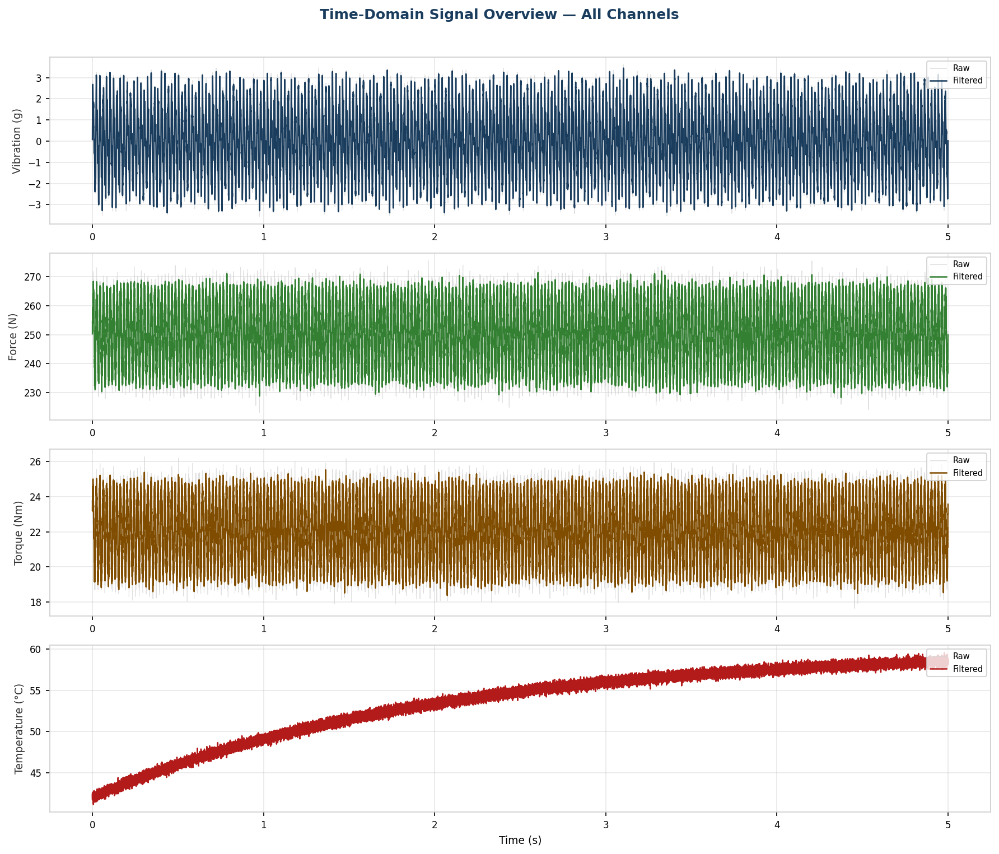
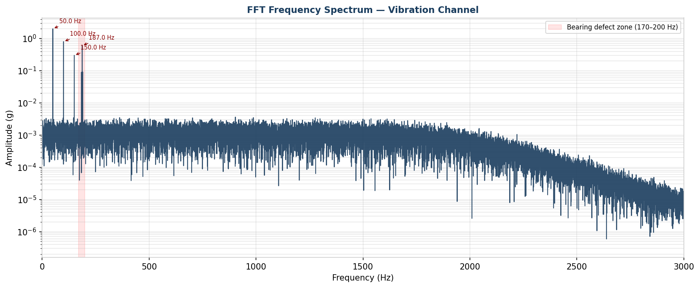
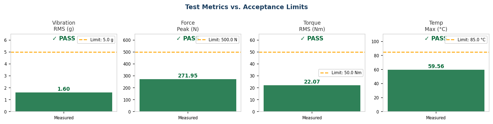

# Rotating Component Test Data Analyser

[](https://github.com/prajwalbekal/rotating-component-test-analyser/actions/workflows/validate.yml)

Automated multi-channel sensor data analysis for rotating component test engineering.

This project simulates an engineering post-processing workflow for endurance-test data. It reads raw sensor data, filters noisy signals, calculates test metrics, performs FFT analysis, flags abnormal frequency signatures, and generates a structured PDF report.

## Why this project matters

Manual test-data review is slow, inconsistent, and easy to repeat incorrectly. This tool shows how a test engineer can move from raw DAQ-style CSV data to a repeatable pass/fail report with plots and diagnostic evidence.

## Features

- Multi-channel analysis for vibration, force, torque, and temperature
- Butterworth low-pass filtering for noise reduction
- FFT-based vibration frequency analysis
- Automatic peak detection for dominant frequencies
- Configurable acceptance limits and pass/fail checks
- PDF report generation with plots and engineering summary
- Optional real-time DAQ simulator with live plots

## Repository Structure

```text
.
+-- src/
|   +-- test_analyser.py      # Batch analysis and PDF report generation
|   +-- daq_realtime.py       # Real-time DAQ simulation and live FFT display
+-- docs/
|   +-- images/               # Generated plot previews for GitHub
|   +-- test_report_sample.pdf
+-- scripts/
|   +-- validate.py           # Deterministic validation checks
+-- requirements.txt
+-- README.md
```

## Pipeline

```text
Raw sensor CSV
  -> Butterworth low-pass filtering
  -> RMS, peak, and mean metrics
  -> FFT frequency analysis
  -> Acceptance-limit evaluation
  -> Automated PDF report
```

## Technical Details

| Item | Value |
| --- | --- |
| Sampling rate | 10,000 Hz |
| Filter | 4th order Butterworth low-pass |
| Cutoff frequency | 2,000 Hz |
| FFT method | Single-sided real FFT |
| Channels | Vibration, force, torque, temperature |
| Report output | PDF plus PNG plots |

The synthetic test data simulates a rotating component at 3,000 RPM with 1x, 2x, and 3x harmonics, sensor noise, and a bearing-defect signature around 187 Hz.

## Results Snapshot

These values come from the deterministic synthetic test run:

| Check | Result |
| --- | ---: |
| Samples analysed | `50,000` |
| Vibration RMS | `1.6020 g` |
| Force peak | `271.9539 N` |
| Torque RMS | `22.0745 Nm` |
| Temperature peak | `59.5630 C` |
| Dominant FFT peaks | `50.0 Hz`, `100.0 Hz`, `187.0 Hz`, `150.0 Hz` |
| Diagnostic note | `187 Hz bearing-defect zone activity detected` |

## Visual Results

### Time-Domain Signals



### FFT Vibration Spectrum



### Metrics vs Acceptance Limits



## Installation

```bash
python -m venv .venv
.venv\Scripts\activate
pip install -r requirements.txt
```

On macOS/Linux:

```bash
python -m venv .venv
source .venv/bin/activate
pip install -r requirements.txt
```

## Usage

Run the batch analyser with generated synthetic data:

```bash
python src/test_analyser.py
```

Run deterministic validation checks:

```bash
python scripts/validate.py
```

The validation run checks channel limits, confirms the 50 Hz shaft frequency, verifies the 187 Hz bearing-defect signature is surfaced, and confirms the PDF/plot outputs are generated.

Run it with your own CSV file:

```bash
python src/test_analyser.py path/to/sensor_data.csv
```

Expected CSV format:

```csv
time_s,vibration_g,force_N,torque_Nm,temperature_C
0.0001,1.234,252.1,22.3,42.0
```

Run the real-time DAQ simulator:

```bash
python src/daq_realtime.py
```

## Output

The batch analyser writes files to `output/`:

- `test_report.pdf` - structured report with metrics, FFT analysis, plots, and pass/fail verdict
- `plot_time_domain.png` - four-channel time-domain overview
- `plot_fft.png` - vibration spectrum with dominant frequency peaks
- `plot_metrics.png` - metrics compared against acceptance limits

A sample report is available at [docs/test_report_sample.pdf](docs/test_report_sample.pdf).

## Engineering Relevance

The workflow reflects practical test automation used in aerospace, automotive, and rotating machinery environments:

- DAQ-style multi-channel measurement
- signal filtering before analysis
- FFT-based fault signature detection
- automated report generation
- repeatable pass/fail evaluation

The same structure can be adapted to rocket component tests, motor test benches, drivetrain endurance tests, or other sensor-heavy validation workflows.

## Author

Prajwal Bekal  
M.Sc. Mechatronics and Cyber-Physical Systems  
Deggendorf Institute of Technology
